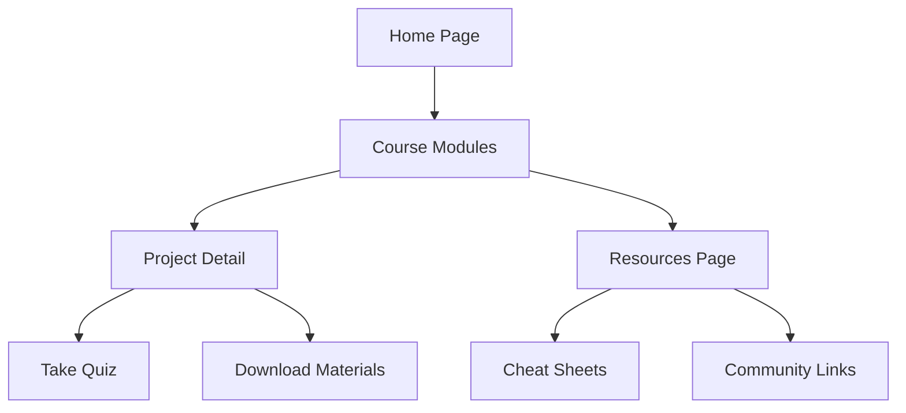

## 1. Product Overview
AI 时代 Python 数据分析实战训练营网站，为学习者提供系统化的数据分析技能培训，通过十个阶梯式项目掌握 Pandas 核心能力。
- 目标用户：希望在 AI 时代提升数据分析能力的学习者，包括学生、数据分析师、AI 从业者等。
- 市场价值：帮助用户掌握企业级数据分析技能，提升职场竞争力。

## 2. Core Features

### 2.1 User Roles
| Role | Registration Method | Core Permissions |
|------|---------------------|------------------|
| Learner | Email registration | Access course content, take quizzes, download materials |

### 2.2 Feature Module
1. **Home page**: hero section, course overview, key features, navigation
2. **Course modules page**: detailed module content, project list, learning path
3. **Project detail page**: project description, code examples, quizzes, download materials
4. **Resources page**: additional resources, cheat sheets, community links

### 2.3 Page Details
| Page Name | Module Name | Feature description |
|-----------|-------------|---------------------|
| Home page | Hero section | Course introduction, key selling points, call-to-action button |
| Home page | Course overview | Brief introduction of the ten projects and five thinking models |
| Home page | Key features | Highlight enterprise-level technologies and core thinking models |
| Course modules page | Module list | Four main modules with project breakdowns |
| Course modules page | Learning path | Visual representation of learning progression |
| Project detail page | Project description | Background, objectives, and key skills of each project |
| Project detail page | Code examples | Interactive code snippets with syntax highlighting |
| Project detail page | Quizzes | Multiple-choice questions for knowledge assessment |
| Project detail page | Download materials | Links to CSV data files and Jupyter notebook templates |
| Resources page | Cheat sheets | Quick reference guides for Pandas functions and thinking models |
| Resources page | Community links | Discussion forums and additional learning resources |

## 3. Core Process
Learners visit the home page to understand the course overview, navigate to the course modules page to explore the learning path, access individual project pages for detailed content and quizzes, and use the resources page for additional support materials.

## 4. User Interface Design
### 4.1 Design Style
- Primary colors: #3B82F6 (blue), #10B981 (green)
- Secondary colors: #F59E0B (amber), #EF4444 (red)
- Button style: Rounded corners, subtle shadow, hover effects
- Font: Inter for body text, Montserrat for headings
- Layout style: Card-based design with clear section divisions
- Icon style: Lucide React icons for consistency

### 4.2 Page Design Overview
| Page Name | Module Name | UI Elements |
|-----------|-------------|-------------|
| Home page | Hero section | Full-width background with gradient, bold heading, concise description, prominent CTA button |
| Home page | Course overview | Grid layout with cards for each module, progress indicators |
| Home page | Key features | Icon-based feature list with brief descriptions |
| Course modules page | Module list | Accordion-style expandable sections for each module, with project links |
| Course modules page | Learning path | Visual timeline showing progression through projects |
| Project detail page | Project description | Clear heading hierarchy, bullet points for key information |
| Project detail page | Code examples | Syntax-highlighted code blocks with copy functionality |
| Project detail page | Quizzes | Interactive multiple-choice questions with instant feedback |
| Project detail page | Download materials | Button links with file type indicators |
| Resources page | Cheat sheets | Collapsible sections for different topics, easy-to-read tables |
| Resources page | Community links | Card-based layout with icons for different platforms |

### 4.3 Responsiveness
- Desktop-first design with mobile-adaptive layouts
- Breakpoints: 1200px (desktop), 768px (tablet), 360px (mobile)
- Touch optimization for mobile devices
- Collapsible navigation menu for mobile

### 4.4 3D Scene Guidance
Not applicable for this project.