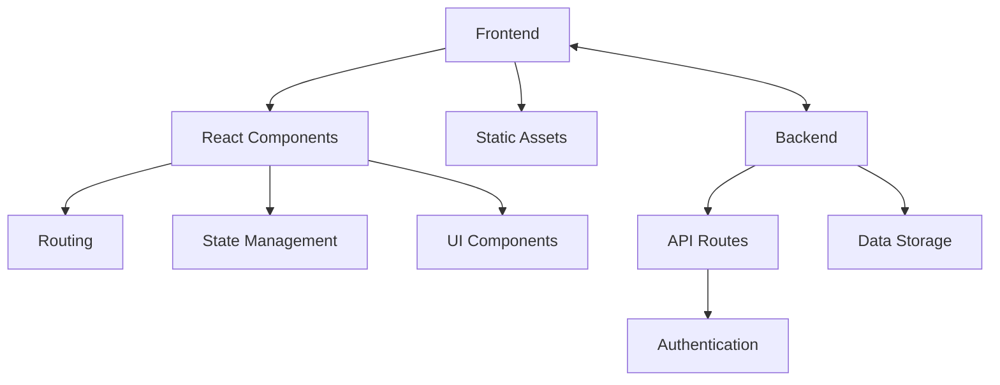

## 1. Architecture Design

## 2. Technology Description
- Frontend: React@18 + tailwindcss@3 + vite
- Initialization Tool: vite-init
- Backend: None (static site with client-side functionality)
- Database: None (static content)

## 3. Route Definitions
| Route | Purpose |
|-------|---------|
| / | Home page with course overview |
| /modules | Course modules page with learning path |
| /project/:id | Project detail page with content and quizzes |
| /resources | Resources page with cheat sheets and links |

## 4. API Definitions
Not applicable for this static site project.

## 5. Server Architecture Diagram
Not applicable for this static site project.

## 6. Data Model
### 6.1 Data Model Definition
Not applicable for this static site project.

### 6.2 Data Definition Language
Not applicable for this static site project.